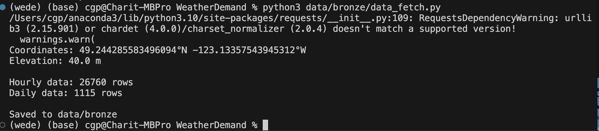

# WeatherDemand

# Weather-Driven Demand Forecasting

Real-time demand prediction system using live weather data for Vancouver, BC. Predicts hourly demand across four business domains with anomaly detection.


## Overview

This project demonstrates an end-to-end ML pipeline that:
- Fetches **live weather data** from Open-Meteo API
- Predicts demand for **4 business domains** (Delivery, Energy, Retail, E-commerce)
- Detects **anomalies** using Z-Score and Local Outlier Factor
- Serves predictions via **REST API** (FastAPI)
- Visualizes results in **Streamlit dashboard**

## Architecture

```
┌─────────────────┐     ┌─────────────────┐     ┌─────────────────┐
│   Open-Meteo    │────▶│   ML Pipeline   │────▶│   Streamlit     │
│   Weather API   │     │   (XGBoost)     │     │   Dashboard     │
└─────────────────┘     └─────────────────┘     └─────────────────┘
                               │                        │
                               ▼                        ▼
                        ┌─────────────────┐     ┌─────────────────┐
                        │    Anomaly      │     │    FastAPI      │
                        │   Detection     │     │    REST API     │
                        │ (Z-Score + LOF) │     │                 │
                        └─────────────────┘     └─────────────────┘
```

### Data Pipeline (Medallion Architecture)

```
┌─────────────────────────────────────────────────────────────────┐
│                    MEDALLION ARCHITECTURE                       
├───────────────────┬───────────────────┬─────────────────────────┤
│   Bronze (Raw)    │  Silver (Cleaned) │     Gold (ML-Ready)     │
├───────────────────┼───────────────────┼─────────────────────────┤
│ hourly_weather.csv│                   │                         │
│        +          │─▶ weather_features│─▶ demand_data.csv       │
│ daily_weather.csv │      .csv         │    (with predictions)   │
└───────────────────┴───────────────────┴─────────────────────────┘

Note: Demand data is synthetically generated with realistic business logic for demonstration.
In production, this pipeline connects to enterprise data sources to ingest actual demand metrics.
Architecture is designed for plug-and-play data integration
```

## Features

### Prediction Domains
| Domain | Description | Model R² |
|--------|-------------|----------|
| Delivery | Food/package orders per hour | 0.343 |
| Energy | Electricity consumption (kWh) | 0.446 |
| Retail | Store foot traffic | 0.729 |
| E-commerce | Online orders per hour | 0.371 |

### Anomaly Detection
- **Z-Score**: Statistical threshold (>2 std dev)
- **Local Outlier Factor**: Density-based detection
- **Consensus voting**: HIGH (both agree), MEDIUM (one flags)

### Location-Aware Logic
- Regional weather patterns affect demand differently
- Peak hours vary by city/timezone
- Current demo: Vancouver, BC
- Architecture supports multi-city expansion

## Tech Stack

Tech Stack
ComponentTechnologyML FrameworkXGBoost, scikit-learnDataPandas, NumPyAPIFastAPI, UvicornUIStreamlit, PlotlyWeather DataOpen-Meteo APICloudAzure ML Studio (model training & hyperparameter tuning)

## Installation

```bash
git clone https://github.com/cgp101/WeatherDemand.git
cd WeatherDemand
pip install -r requirements.txt
```

## Usage

### Streamlit Dashboard
```bash
streamlit run app.py
```

### REST API
```bash
uvicorn api.main:app --reload
```

**Endpoints:**
| Endpoint | Description |
|----------|-------------|
| `GET /predict/{domain}` | 24hr demand forecast |
| `GET /anomaly/{domain}` | Anomaly detection results |
| `GET /drift/{domain}` | Model drift check |
| `GET /health` | Health check |

## Model Performance

Compared 5 algorithms across all domains:

| Model | Delivery | Energy | Retail | E-commerce |
|-------|----------|--------|--------|------------|
| Ridge | 0.273 | 0.306 | 0.333 | 0.284 |
| Random Forest | 0.339 | 0.432 | 0.721 | 0.364 |
| **XGBoost** | **0.343** | **0.446** | **0.729** | **0.371** |
| MLP | 0.304 | 0.411 | 0.699 | 0.327 |
| LSTM | 0.312 | 0.333 | 0.710 | 0.301 |

XGBoost selected as best performer across all domains.

## Project Structure

```
WeatherDemand/
├── app.py                 # Streamlit dashboard
├── api/
│   └── main.py            # FastAPI REST endpoints
├── Weather_Models/
│   ├── delivery_xgb.pkl
│   ├── energy_xgb.pkl
│   ├── retail_xgb.pkl
│   └── ecommerce_xgb.pkl
├── notebooks/
│   ├── 01_data_collection.ipynb
│   ├── 02_data_cleaning.ipynb
│   ├── 03_feature_engineering.ipynb
│   ├── 04_model_training.ipynb
│   └── 05_anomaly_detection.ipynb
├── data/
│   ├── bronze/            # Raw API data
│   ├── silver/            # Cleaned data
│   └── gold/              # ML-ready features
└── requirements.txt
```

## Future Enhancements

- [ ] **MCP Server** - Claude/LLM tool integration
- [ ] **Azure AI Agent** - Pluggable KB connectors 
- [ ] **Auto-retraining** - Feedback loop for model updates
- [ ] **SHAP/LIME** - Explainability for predictions
- [ ] **Multi-city support** - Extend beyond Vancouver

## Screenshots
Fetching Data from Open-Metro - between START_DATE and END_DATE. 
Example: 
START_DATE = "2023-01-01"
END_DATE = "2026-01-19"
latitude and longitude for the location. 


## License

MIT

---
